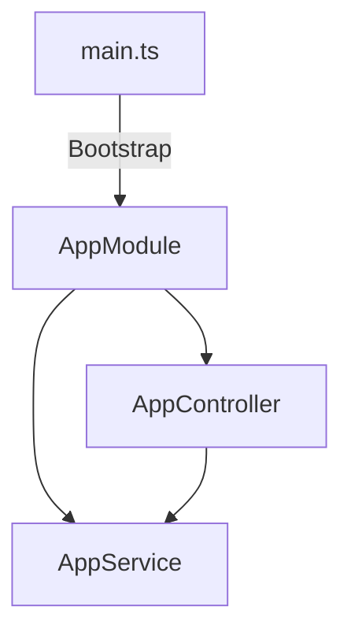

# Travel Buddy NestJS Architecture

## Core Concepts

### 1. Module System ([`src/app.module.ts`](src/app.module.ts))

```typescript
@Module({
  imports: [],
  controllers: [AppController], // Line 7
  providers: [AppService], // Line 8
})
export class AppModule {}
```

### 2. Controller Layer ([`src/app.controller.ts`](src/app.controller.ts:5))

```typescript
@Controller()
export class AppController {
  constructor(private readonly appService: AppService) {} // Line 5

  @Get()
  getHello(): string {
    // Line 8
    return this.appService.getHello();
  }
}
```

### 3. Service Provider ([`src/app.service.ts`](src/app.service.ts:5))

```typescript
@Injectable()
export class AppService {
  getHello(): string {
    // Line 5
    return 'Hello World!';
  }
}
```

## Bootstrapping ([`src/main.ts`](src/main.ts:5))

```typescript
async function bootstrap() {
  const app = await NestFactory.create(AppModule); // Line 5
  await app.listen(3000); // Line 6
}
```

## Dependency Graph



## Testing Strategy ([`test/app.e2e-spec.ts`](test/app.e2e-spec.ts))

```typescript
describe('AppController (e2e)', () => {
  // Line 5
  it('/ (GET)', () => {
    // Line 11
    return request(app.getHttpServer())
      .get('/')
      .expect(200)
      .expect('Hello World!');
  });
});
```
